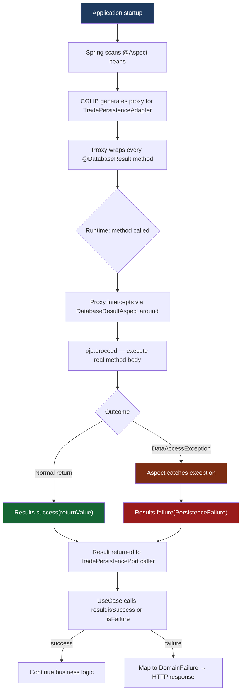

# AOP Database Result Strategy

## The "No Manual Try-Catch" Policy

SentinelTrade enforces a strict rule: **no `try-catch` blocks exist in service or use-case layers**. All database exception handling is owned by a single Spring AOP aspect, keeping domain logic clean and purely functional.

This policy exists because:

- **Try-catch in business code is a leaky abstraction.** The moment a use-case catches a `DataAccessException`, it is coupled to the persistence technology. Swap Postgres for Cassandra and every use-case that catches SQL exceptions breaks.
- **Scattered exception handling is untestable.** A single aspect is one unit to test. Dozens of `try-catch` blocks in dozens of use-cases is a maintenance minefield.
- **Result4J makes the happy and failure paths explicit.** Callers of `TradePersistencePort` always receive a `Result<T, F>` — they are forced by the type system to handle both outcomes without exceptions being the control-flow mechanism.

---

## How `@DatabaseResult` Works

```
@DatabaseResult
    │
    ▼
Spring creates a CGLIB proxy around TradePersistenceAdapter
    │
    ▼
Every annotated method call is intercepted by DatabaseResultAspect.around()
    │
    ├─► calls ProceedingJoinPoint.proceed()  (the real method body)
    │       │
    │       ├── success → wraps return value in Results.success(value)
    │       │
    │       └── DataAccessException thrown → catches it
    │                                         wraps in Results.failure(PersistenceFailure)
    ▼
Caller receives Result<T, PersistenceFailure> — never an exception
```

The annotation itself carries no logic. It is a marker that tells the aspect which methods to intercept:

```java
@Target(ElementType.METHOD)
@Retention(RetentionPolicy.RUNTIME)
public @interface DatabaseResult {}
```

The aspect is the sole implementation:

```java
@Aspect
@Component
public class DatabaseResultAspect {

    @Around("@annotation(com.sentinel.aop.DatabaseResult)")
    public Object handle(ProceedingJoinPoint pjp) throws Throwable {
        try {
            Object result = pjp.proceed();
            return Results.success(result);
        } catch (DataAccessException ex) {
            return Results.failure(new PersistenceFailure(ex.getMessage()));
        }
    }
}
```

---

## Correct vs. Wrong Usage

### Correct — adapter method annotated, no try-catch anywhere in business code

```java
// TradePersistenceAdapter.java  ✅
@DatabaseResult
public Result<Trade, PersistenceFailure> save(Trade trade) {
    TradeEntity entity = mapper.toEntity(trade);
    TradeEntity saved = repository.save(entity);  // may throw DataAccessException
    return Results.success(mapper.toDomain(saved));
    // If DataAccessException is thrown, the aspect returns Results.failure(...) instead
    // This method never needs to know about that.
}

// ProcessTradeUseCase.java  ✅  — clean, no infrastructure concerns
public Result<TradeResponse, DomainFailure> processTrade(TradeRequest request, Principal principal) {
    Trade trade = Trade.create(request, principal.accountId());
    return persistencePort.persist(trade)
        .map(this::toResponse)
        .mapFailure(DomainFailure::fromPersistence);
    // No try-catch. No DataAccessException import. No infrastructure leak.
}
```

### Wrong — try-catch in the use-case layer

```java
// ProcessTradeUseCase.java  ❌  — DO NOT DO THIS
public TradeResponse processTrade(TradeRequest request, Principal principal) {
    Trade trade = Trade.create(request, principal.accountId());
    try {
        return persistencePort.persist(trade);  // wrong: port should return Result, not throw
    } catch (DataAccessException ex) {          // wrong: use-case is coupled to Spring Data
        log.error("DB error", ex);
        throw new RuntimeException("persistence failed", ex);  // wrong: re-throwing loses context
    }
}
```

---

## Aspect Weaving Flow


