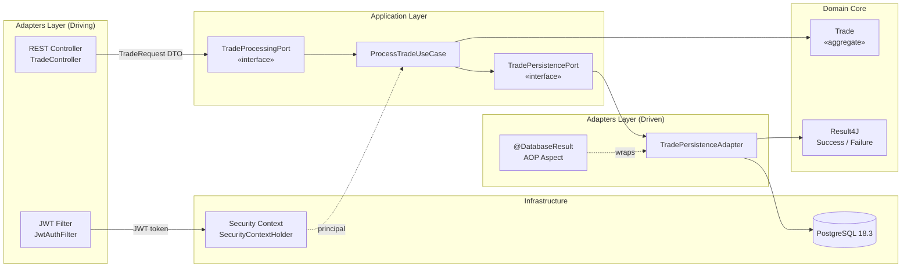
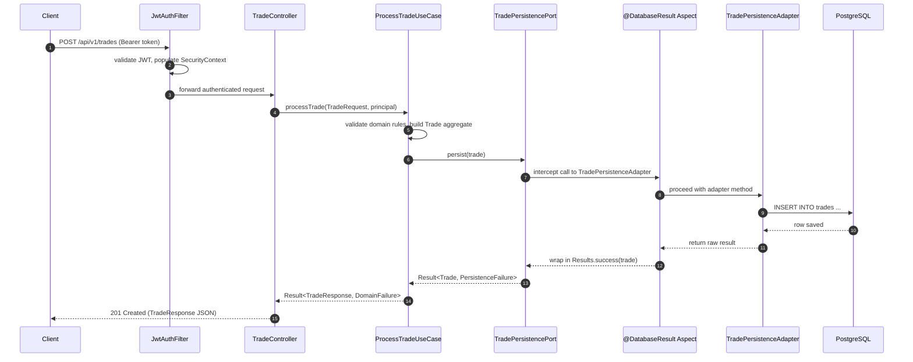
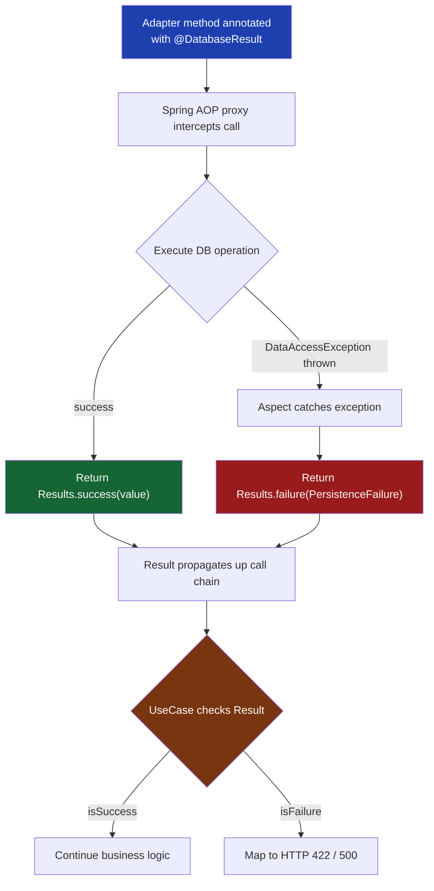

# SentinelTrade Architecture

## System Overview

SentinelTrade is a high-throughput trade surveillance engine designed to detect anomalous trading patterns in real time. It is built to sustain **5,000 trades per second** with end-to-end latency under **50ms**, leveraging Java 25 virtual threads, PostgreSQL 18.3 with io_uring async I/O, and a strict hexagonal architecture that isolates domain logic from infrastructure concerns.

---

## Hexagonal Architecture Diagram

---

## Request Flow

---

## AOP + Result4J Flow

**Key guarantee:** zero `try-catch` blocks appear in service or use-case layers. All exception handling is centralised in the `@DatabaseResult` aspect.

---

## Tech Stack

| Component        | Technology                        | Version  |
|------------------|-----------------------------------|----------|
| Language         | Java (Virtual Threads, Records)   | 25       |
| Framework        | Spring Boot                       | 4.0.5    |
| Database         | PostgreSQL (io_uring async I/O)   | 18.3     |
| Error Handling   | Result4J                          | latest   |
| Resilience       | Resilience4j (circuit breaker)    | 2.x      |
| Authentication   | JJWT                              | 0.12.x   |
| Build Tool       | Maven                             | 3.9+     |
| Observability    | Micrometer + Prometheus           | —        |
