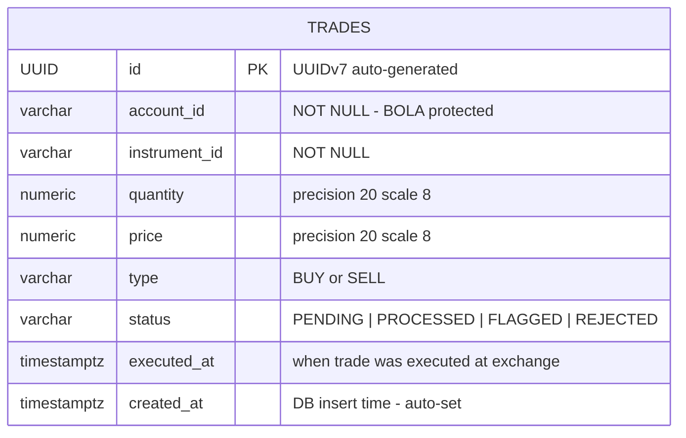

# SentinelTrade Entity Relationship Diagram

## Schema Overview

SentinelTrade uses **PostgreSQL 18.3** as its primary datastore, taking advantage of the new `io_uring`-based async I/O backend that eliminates blocking syscalls on the hot write path. All primary keys use **UUIDv7** — a time-ordered UUID variant that is monotonically increasing, embeds the creation timestamp, and clusters naturally in B-tree indexes.

---

## Entity Relationship Diagram

> Additional tables (users, audit_log, alert_rules) will be added in subsequent milestones and linked here once their schemas are finalised.

---

## UUIDv7 Strategy

| Property          | UUIDv4                          | UUIDv7 (chosen)                              |
|-------------------|---------------------------------|----------------------------------------------|
| Ordering          | Random — no ordering guarantee  | Monotonically increasing by millisecond      |
| Index fragmentation | High — random inserts scatter pages | Low — sequential inserts cluster pages  |
| Timestamp embedded | No                             | Yes — first 48 bits are Unix ms timestamp   |
| Sortability       | Not sortable by time            | Lexicographically sortable = time-sortable  |
| Debuggability     | Opaque                          | Can decode creation time from the ID itself |

UUIDv7 eliminates the classic B-tree page-split problem caused by random UUID inserts at scale. At 5,000 trades/sec, this reduces write amplification significantly and keeps hot index pages in the buffer pool.

---

## Indexing Strategy

| Index Name                    | Column(s)                    | Type    | Purpose                                                      |
|-------------------------------|------------------------------|---------|--------------------------------------------------------------|
| `trades_pkey`                 | `id`                         | B-tree  | Primary key lookup; UUIDv7 keeps inserts sequential          |
| `idx_trades_account_id`       | `account_id`                 | B-tree  | Per-account trade history queries; supports BOLA checks      |
| `idx_trades_status`           | `status`                     | B-tree  | Filter PENDING trades for surveillance processing pipeline   |
| `idx_trades_executed_at`      | `executed_at DESC`           | B-tree  | Time-range queries for surveillance windows                  |
| `idx_trades_account_exec`     | `account_id, executed_at`    | B-tree  | Composite — account-scoped time-window scans                 |
| `idx_trades_instrument_id`    | `instrument_id`              | B-tree  | Instrument-level aggregation queries                         |

---

## BOLA Protection

**Broken Object Level Authorization (BOLA)** is enforced at two layers:

1. **Application layer** — `ProcessTradeUseCase` extracts the authenticated principal from `SecurityContextHolder` and asserts that `trade.accountId()` matches the JWT subject before any persistence call is made. Mismatches short-circuit with a `Result.failure(AuthorizationFailure)`.

2. **Database layer** — Row-level security (RLS) policies on the `trades` table enforce that `account_id = current_setting('app.current_account_id')`. The JDBC connection pool sets this session variable from the verified JWT claim before executing any statement, providing defence-in-depth against account-ID tampering even if the application layer is bypassed.

This dual-layer strategy ensures that no authenticated user can read or write trade records belonging to another account, even through indirect query paths.
