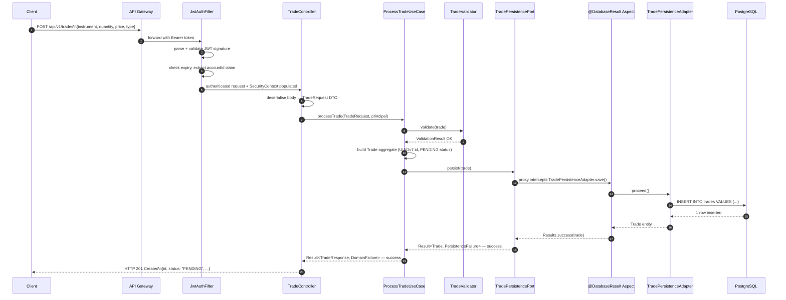
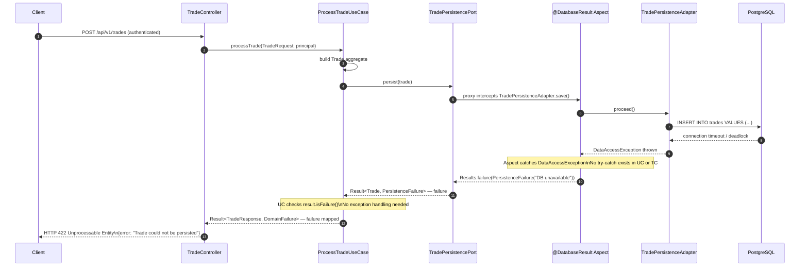
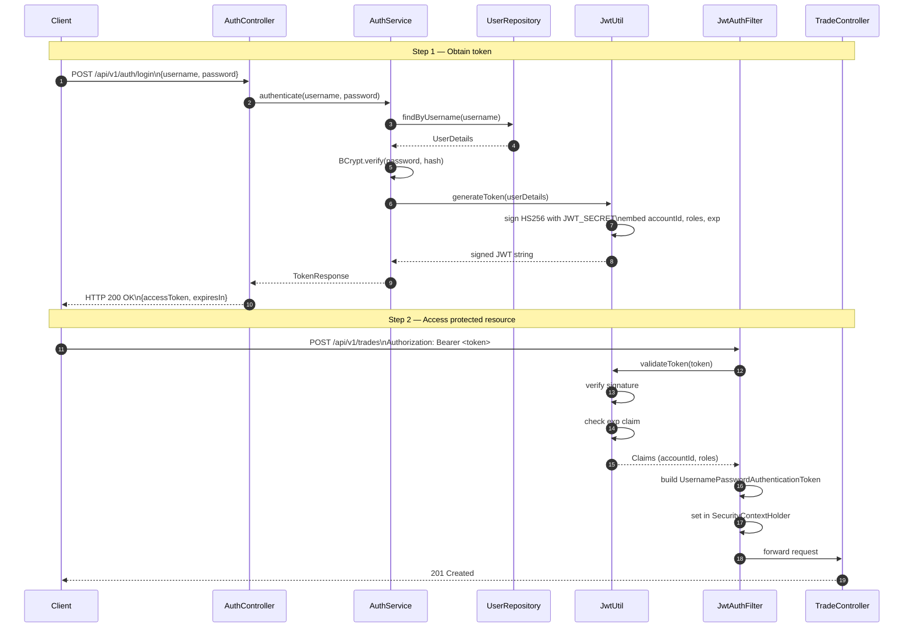

# SentinelTrade Sequence Diagrams

## Trade Ingestion — Happy Path

---

## Trade Ingestion — Database Failure Path

This diagram shows how a database failure is handled **without any try-catch in business code**. The `@DatabaseResult` AOP aspect intercepts the `DataAccessException`, wraps it in a `Result.failure`, and the failure propagates up the call chain functionally.

**Invariant:** Neither `ProcessTradeUseCase` nor `TradeController` contains a single `try`, `catch`, or `throws` clause. All exception handling lives exclusively in the `@DatabaseResult` aspect.

---

## JWT Authentication Flow

